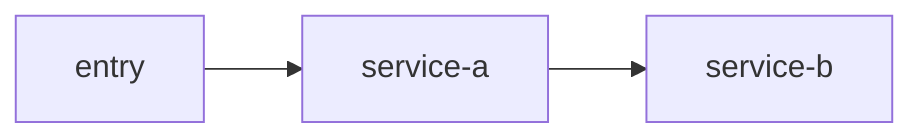

# Diagram Output Guidelines

This page defines how `backend-service-spec-skill` should output diagram artifacts, and why the default format is `Markdown + Mermaid` rather than image-only files.

## 1. Default Format

Diagram artifacts should default to:

- `.md`
- Mermaid fenced code blocks

Avoid relying only on:

- `.png`
- `.jpg`
- screenshot-style flowcharts

Why:

- AI reads text source more reliably
- incremental updates are easier
- diagrams can cross-link cleanly with documentation pages

## 2. Recommended Directories

```text
mydocs/diagrams/
  architecture/
  call-graph/
  upstream-downstream/
  sequence/
```

## 2.5 Placement Rule

Default strategy:

- embed the diagram directly in the corresponding document first

Split the diagram into `mydocs/diagrams/` only when one of these is true:

- the same diagram needs to be reused by multiple documents
- the diagram is expected to change independently and frequently
- the team needs centralized export or management for PNG / SVG or diagram assets
- the user explicitly asks for diagram/text separation

If the diagram is split out:

- keep a short summary in the parent document
- add a direct link to the standalone diagram file
- keep enough local wording around the link so AI can still understand what the diagram represents

## 3. Mapping From Core Commands To Diagram Artifacts

- `create_codemap`
  - `mydocs/diagrams/architecture/<scope>-architecture.md`
  - `mydocs/diagrams/call-graph/<scope>-call-graph.md`
- `service_deep_dive`
  - `mydocs/diagrams/upstream-downstream/<service>-dependencies.md`
  - `mydocs/diagrams/architecture/<service>-module-architecture.md`
- `crate_router_map`
  - `mydocs/diagrams/sequence/<flow>-sequence.md`
  - `mydocs/diagrams/call-graph/<flow>-call-graph.md`
- `build_domain_map`
  - `mydocs/diagrams/architecture/<domain>-domain-context.md`

## 4. Minimal Template

````md
# <diagram-name>

## 1. Scope
## 2. Evidence basis



## 3. Node notes
## 4. Edge notes
## 5. Unresolved gaps
````

## 5. Output Rules

- prefer real service, module, topic, and interface names from code
- label edges with call type where possible, such as `HTTP`, `Feign`, `MQ`, or `Callback`
- explain closure state, evidence source, and unresolved items below the diagram
- do not draw guessed relationships as confirmed relationships
- prefer role-semantic or action-semantic node labels over raw method signatures such as `method(arg)`
- keep exact method names, DTO names, enum names, Redis keys, and similar precision details in the text below the diagram rather than packing them into one Mermaid node
- avoid mixing parentheses-heavy signatures, JSON fragments, unescaped quotes, or dense punctuation inside a single node label
- if you need to express a lookup by field, prefer a short phrase like `query group relation by businessId`
- before considering a diagram complete, do a quick label sanity check and remove labels likely to confuse stricter Mermaid parsers
- after generating the diagram, explicitly compare it against `mermaid-safety-checklist.zh-CN.md` and the minimal good/bad examples there before delivery

## 6. Derived Images

If the team needs PNG / SVG:

- export them from the Mermaid source in `.md`
- keep the `.md` source file as the authoritative version
