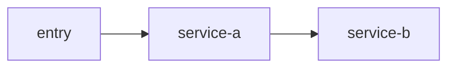

# 图产物输出规范

本文用于约束 `backend-service-spec-skill` 的图类产物如何输出，以及为什么默认选择 `Markdown + Mermaid` 而不是图片。

## 1. 默认格式

图类产物默认使用：

- `.md`
- Mermaid fenced code block

不推荐只输出：

- `.png`
- `.jpg`
- 仅截图形式的流程图

原因：

- AI 对文本源的读取更稳定
- 更适合增量更新
- 更容易和文档页做双向引用

## 2. 推荐目录

```text
mydocs/diagrams/
  architecture/
  call-graph/
  upstream-downstream/
  sequence/
```

## 2.5 放置规则

默认策略：

- 优先把图直接内嵌到对应正文文档

只有命中以下任一条件时，才拆分到 `mydocs/diagrams/`：

- 同一张图需要被多个文档复用
- 图预计会独立且高频更新
- 团队需要集中导出或统一管理 PNG / SVG 或图资产
- 用户明确要求图文分离

如果图被拆出：

- 正文中仍要保留一段简短摘要
- 正文中还要附上该独立图文件的直接链接
- 链接前后要保留足够语义，让 AI 仍能理解这张图表达的对象和作用

## 3. 四个核心命令与图产物的关系

- `create_codemap`
  - `mydocs/diagrams/architecture/<scope>-architecture.md`
  - `mydocs/diagrams/call-graph/<scope>-call-graph.md`
- `service_deep_dive`
  - `mydocs/diagrams/upstream-downstream/<service>-dependencies.md`
  - `mydocs/diagrams/architecture/<service>-module-architecture.md`
- `crate_router_map`
  - `mydocs/diagrams/sequence/<flow>-sequence.md`
  - `mydocs/diagrams/call-graph/<flow>-call-graph.md`
- `build_domain_map`
  - `mydocs/diagrams/architecture/<domain>-domain-context.md`

## 4. 最小模板

````md
# <diagram-name>

## 1. Scope
## 2. Evidence basis



## 3. Node notes
## 4. Edge notes
## 5. Unresolved gaps
````

## 5. 输出要求

- 节点名尽量使用代码中真实出现的服务名、模块名、topic 名、接口名
- 边要尽量标注调用类型，例如 `HTTP`、`Feign`、`MQ`、`Callback`
- 图中的闭环状态、证据来源、未确认项要在图下文字说明中写清楚
- 不要把猜测关系直接画成已确认关系
- 节点标签优先写“角色语义”或“动作语义”，不要默认把 `method(arg)` 这类方法签名直接放进节点
- 精确方法名、DTO 名、枚举名、Redis key、topic 名等细节，更适合放在图下正文说明，而不是塞进同一个 Mermaid 节点
- 单个节点里避免同时混入括号参数、复杂 JSON、未转义引号、过长冒号串、过密标点
- 如果需要表达“按某字段查询”，优先写成 `query group relation by businessId` 这类短语，而不是 `getGroupChatRelationshipInfo(businessId)`
- 在标准产物交付前，至少肉眼复查一遍 Mermaid 节点文本，优先消除容易触发解析器误判的括号签名式写法

## 6. 派生图片

如果团队需要 PNG / SVG：

- 可以从 `.md` 中的 Mermaid 再导出
- 但 `.md` 源文件仍然是唯一权威版本
