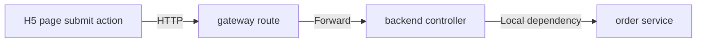

# Mermaid 自检清单

本文用于约束图产物在交付前的最后一轮自检，目标不是补业务内容，而是降低 Mermaid 渲染失败、标签歧义、AI 误读和后续维护困难的风险。

## 1. 使用时机

适用场景：

- 已经生成了 Markdown + Mermaid 图产物
- 准备把图写入 `mydocs/` 或中央知识库
- 需要在交付前做最后一轮图可读性与可渲染性检查

不解决的问题：

- 不负责替代业务分析
- 不负责补证据闭环
- 不负责决定图该画什么
- 只负责检查“这张图现在这样写，会不会出问题”

## 2. 最低自检规则

每张 Mermaid 图在交付前，至少检查以下 6 项：

1. 能否稳定渲染
2. 节点标签是否过于代码化
3. 是否混入高风险字符
4. 边标签是否清楚
5. 图下说明是否补齐
6. 是否把猜测关系画成已确认关系

## 3. 节点标签检查

推荐写法：

- `query group relation by businessId`
- `sync chat record in database`
- `trigger topic video creation`
- `group reply event handler`

不推荐写法：

- `getGroupChatRelationshipInfo(businessId)`
- `modifyChatRecord({"msgKey":"123"})`
- `handlerSelectReplyPromptSpeak(groupId,userId)`
- `processStackWaitMessage(new AigcGroupAiHelperDTO(...))`

检查点：

- 单个节点里不要默认放完整方法签名
- 单个节点里不要混入复杂 JSON
- 单个节点里不要混入未转义引号
- 单个节点里不要同时堆很多括号、冒号、泛型、构造参数
- 节点优先表达“动作语义”或“角色语义”
- 精确代码细节放到图下说明里

## 4. 高风险字符检查

如果节点中出现以下内容，要特别警惕：

- `(` `)`
- `{` `}`
- `"` `'`
- 过长的 `:` 串
- 泛型尖括号
- 很长的 URL
- 很长的 SQL / JSON / payload 片段

处理原则：

- 能改成短语就改成短语
- 能放正文说明就不要塞节点里
- 图节点优先保证稳定渲染

## 5. 边标签检查

检查点：

- 边是否标注了调用类型
- 同步和异步是否区分
- gateway / bridge / callback / local dependency 是否清楚
- 不要让边只剩箭头，没有语义

推荐边标签：

- `HTTP`
- `Feign`
- `MQ`
- `Callback`
- `Gateway`
- `Bridge`
- `Runtime invocation`
- `Local dependency`

## 6. 图下说明检查

每张图下建议至少补这几项：

- 主要节点表示什么
- 主要边标签表示什么
- 证据来自哪里
- 当前哪些部分是 `fact-closed`
- 哪些部分仍是 `contract-visible` / `clue` / `unresolved`

如果没有图下说明，常见问题是：

- 人能看懂一半
- AI 下次复用时容易误读
- 图里的缩写和短语后续难维护

## 7. 证据等级检查

必须确认：

- 图里画出的关系，是否真的有代码证据
- 如果只有调用侧，没有处理侧，不能画成完全闭环
- 如果只是命名猜测，必须标注为 `clue`
- 如果代码存在但当前未启用，不能画成线上真实生效链路

推荐标注：

- `fact-closed`
- `fact-send-side`
- `fact-receive-side`
- `contract-visible`
- `clue`
- `fact-code-present-but-disabled`
- `fact-code-present-no-op`

## 8. 快速自检问答

在提交图前，快速问自己：

1. 这张图里有没有 `method(arg)` 这种节点？
2. 有没有一眼看上去像代码片段而不是图节点的文本？
3. 有没有 JSON、引号、构造参数直接塞进节点？
4. 如果 Mermaid 渲染器更严格，这张图会不会炸？
5. 如果用户不看正文，只看图，是否还能理解主干？
6. 如果 AI 下次复用这张图，是否会误把线索当事实？

## 9. 最终通过标准

可以交付的最低标准：

- 图能稳定渲染
- 节点标签短而清楚
- 边标签不含糊
- 图下说明存在
- 事实与线索没有混写
- 高风险字符没有直接堆进节点

## 10. 最小合格示例与错误示例

推荐示例：



图下说明示例：

- `H5 page submit action` 表示页面触发提交动作，不在节点里直接写 `submitOrder(orderId, userId)`
- `gateway route` 表示入口转发层，具体网关路径和配置写在正文
- `backend controller -> order service` 当前为 `fact-closed`

错误示例：

```mermaid
flowchart LR
    A[submitOrder(orderId, userId, {"source":"h5"})] --> B[/api/order/submit]
    B --> C[OrderController.submit(orderId)]
```

错误原因：

- 节点直接塞入 `method(arg)`、JSON 片段和复杂参数
- 边没有标注调用类型
- 接口路径、方法签名、参数细节都堆进节点，渲染和复用都不稳定

## 11. 一句话原则

图节点负责“稳定表达结构”，图下正文负责“精确表达代码事实”。
