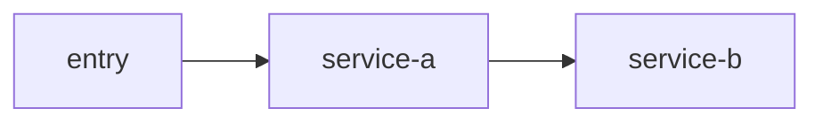

# 输出模板样例

本文提供四类产物的最小模板，并补充“workspace 范围识别”“大服务第二轮增强”“证据闭环等级”“参数清晰度分层”。

## 0. workspace 范围识别模板

```md
# <scope> 范围识别

## 1. 当前 scope
## 2. workspace_type
## 3. 判断依据
## 4. 推荐下一步
## 5. 当前边界
```

推荐落点：

```text
mydocs/index/<scope>-workspace-classification.md
```

## 0.5 图产物通用模板

图类产物默认使用 `Markdown + Mermaid`，不要只输出图片。

默认放置规则：

- 优先把图直接内嵌到对应正文文档
- 只有在图需要跨文档复用、需要独立高频更新、需要集中导出或管理，或用户明确要求图文分离时，才拆到 `mydocs/diagrams/`
- 如果拆到 `mydocs/diagrams/`，正文里仍要保留简短说明，并附上该图文件链接

Mermaid 兼容性提醒：

- 图节点优先写短语式动作语义或角色语义
- 不要默认把 `method(arg)`、复杂 JSON、未转义引号直接塞进节点标签
- 精确方法名与参数细节更适合写在图下说明中

推荐落点：

```text
mydocs/diagrams/architecture/
mydocs/diagrams/call-graph/
mydocs/diagrams/upstream-downstream/
mydocs/diagrams/sequence/
```

通用模板：

````md
# <diagram-name>

## 1. Scope
## 2. Evidence basis



## 3. Node notes
## 4. Edge notes
## 5. Unresolved gaps
````

## 1. 跨服务 create_codemap 模板

```md
# <system-or-group> 服务总图

## 1. 梳理范围
## 2. workspace 范围判断
## 3. 服务清单
## 4. 服务职责与边界
## 5. 通信关系总图
## 6. 技术架构与中间件
## 7. 关键业务链路索引
## 8. 风险与盲区
## 9. 证据来源
```

推荐落点：

```text
mydocs/codemap/<name>.md
```

推荐附带图产物：

```text
mydocs/diagrams/architecture/<name>-architecture.md
mydocs/diagrams/call-graph/<name>-call-graph.md
```

如果拆分图文件，正文中建议这样写：

````md
## 架构图

本轮将架构图单独维护，便于复用与增量更新：

- [架构图](../diagrams/architecture/<name>-architecture.md)

## 服务调用关系图

- [服务调用关系图](../diagrams/call-graph/<name>-call-graph.md)
````

## 2. crate_router_map 模板

```md
# <route-name> 路由总图

## 1. 链路范围
## 2. 入口请求
## 3. 涉及服务与仓库
## 4. 同步调用链
## 5. 异步消息链
## 6. 定时 / 补偿链
## 7. 实时通道链（如有）
## 8. 中间状态与存储
## 9. 失败重试 / 幂等 / 补偿线索
## 10. 证据等级说明
## 11. 代码证据
```

推荐落点：

```text
mydocs/routermap/<route-name>.md
```

推荐附带图产物：

```text
mydocs/diagrams/sequence/<route-name>-sequence.md
mydocs/diagrams/call-graph/<route-name>-call-graph.md
```

如果拆分图文件，正文中建议这样写：

````md
## 时序图

- [时序图](../diagrams/sequence/<route-name>-sequence.md)

## 链路调用图

- [链路调用图](../diagrams/call-graph/<route-name>-call-graph.md)
````

通信链路表建议：

```md
| step | from | to | type | interface/topic | evidence_level | evidence |
| --- | --- | --- | --- | --- | --- | --- |
```

推荐 `evidence_level`：

- `fact-closed`
- `fact-send-side`
- `fact-receive-side`
- `contract-visible`
- `clue`

## 3. 业务域页模板

```md
# <domain> 业务域知识页

## 1. 域定义
## 2. 域内主服务
## 3. 域内能力归纳
## 4. 与其他域的关系
## 5. 当前边界
## 6. 使用建议
## 7. 来源追溯
```

域目录建议：

```text
mydocs/domains/<domain>/
  overview.md
  services.md
  rules.md
  sources.md
```

推荐附带图产物：

```text
mydocs/diagrams/architecture/<domain>-domain-context.md
```

如果拆分图文件，正文中建议这样写：

````md
## 域上下文图

- [域上下文图](../diagrams/architecture/<domain>-domain-context.md)
````

## 4. 单服务第一轮模板

```md
# <service> 服务知识页

## 1. 服务定位
## 2. 代码骨架
## 3. 启动与框架事实
## 4. 当前已确认的高价值入口
## 5. 当前页面边界
```

第一轮最小页面集合：

```text
mydocs/services/<service>/
  overview.md
  entrypoints.md
  dependencies.md
  mq.md
  sources.md
```

推荐附带图产物：

```text
mydocs/diagrams/upstream-downstream/<service>-dependencies.md
mydocs/diagrams/architecture/<service>-module-architecture.md
```

如果拆分图文件，正文中建议这样写：

````md
## 上下游依赖图

- [上下游依赖图](../../diagrams/upstream-downstream/<service>-dependencies.md)

## 模块架构图

- [模块架构图](../../diagrams/architecture/<service>-module-architecture.md)
````

## 5. 单服务第二轮增强模板

适用于接口面宽、通信面多、外部依赖重的大服务。

```text
mydocs/services/<service>/
  overview.md
  entrypoints.md
  dependencies.md
  mq.md
  sources.md

  api.md
  call-chain.md
  external-dependencies.md
  handlers.md
  db.md
  business-rules.md
  state-machine.md
  route-map.md
  topic-detail.md
  ws.md
  runtime-config.md
  error-catalog.md
  risk-and-hotspots.md
  scenario-<name>.md
```

## 6. api.md 参数清晰度模板

```md
# <service> API Surface

## 1. Scope
## 2. Parameter clarity levels
## 3. HTTP / Feign / callback contracts
## 4. DTO field tables confirmed in this round
## 5. Selected response surface
## 6. Current boundary
```

建议显式区分：

- `path-level clear`
- `signature-level clear`
- `dto-level partly clear`
- `payload/schema unresolved`

## 7. sibling-service-context 模板

```md
# <service-family> 服务家族上下文

## 1. 范围
## 2. 家族内服务清单
## 3. 直接可确认的职责分布
## 4. 直接可确认的通信线索
## 5. 尚未闭环确认的关系
## 6. 后续建议
## 7. 证据来源
```

推荐落点：

```text
mydocs/context/<service-family>-context.md
```
