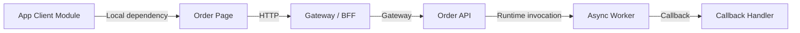
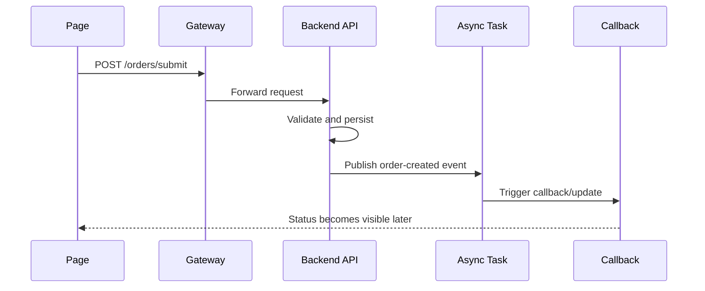

# Mixed-Stack Diagram Output Example Template

This template shows what a mixed-stack diagram-oriented output can look like when `cross-tech-stack-spec-skill` is used in a standard run.

Use it as:

- a reference layout for AI-generated outputs
- a review baseline for central knowledge repository documents
- a quick example for teams that want text + Mermaid outputs in one page

## 1. Example Scope

Example scenario:

- page submits an order request
- app/client layer enriches context
- gateway forwards the request
- backend service writes data and triggers an async task
- callback or downstream consumer updates final status

## 2. Recommended Page Structure

Recommended section order:

1. scope and evidence statement
2. mixed-stack architecture diagram
3. cross-layer call graph
4. key sequence diagram
5. interface / gateway / context / async drill-down diagrams when enabled
6. unresolved items

## 3. Scope And Evidence Statement Example

Example wording:

```md
## Scope

This page documents the `submitOrder` flow across page, app, gateway, backend, async task, and callback layers.

## Evidence Boundary

- page request declaration visible
- app API wrapper visible
- gateway forwarding rule visible
- backend controller and service visible
- async producer and consumer visible
- callback closure partially visible
```

## 4. Mixed-Stack Architecture Diagram Example



Recommended summary text under the diagram:

```md
This diagram shows the stable cross-layer shape of the `submitOrder` flow.
The gateway and async worker are both part of the critical path.
Node meaning: `Order Page` is the caller-side page, `Gateway / BFF` is the forwarding boundary, and `Async Worker` is the runtime continuation layer.
Evidence basis: page request declaration, gateway forwarding rule, backend handler, and async producer/consumer are all visible in code.
Closure state: callback closure remains partially closed in the current scope.
```

## 5. Cross-Layer Call Graph Example

```mermaid
flowchart TD
    PageSubmit[Page: submitOrder()]
    ApiWrapper[Client API Wrapper]
    GatewayRoute[Gateway Route]
    Controller[Backend Controller]
    Service[Order Service]
    Producer[Event Producer]
    Consumer[Async Consumer]

    PageSubmit -->|HTTP| ApiWrapper
    ApiWrapper -->|HTTP| GatewayRoute
    GatewayRoute -->|Gateway| Controller
    Controller -->|Runtime invocation| Service
    Service -->|MQ| Producer
    Producer -->|MQ| Consumer
```

Recommended summary text:

```md
The synchronous path closes at `Order Service`.
The async continuation is visible from producer to consumer, but the final business acknowledgment remains partially closed.
Edge meaning: `HTTP` is request dispatch, `Gateway` is forwarding through the gateway layer, and `MQ` is async event delivery.
Evidence basis: client wrapper, gateway route, backend handler, and producer/consumer call sites are directly visible.
```

## 6. Sequence Diagram Example



Recommended summary text:

```md
This sequence highlights the handoff from synchronous request handling to asynchronous completion.
If callback evidence is incomplete, mark the final step as partially closed.
Do not redraw the callback as fully confirmed unless the receiver-side evidence is also visible.
```

## 7. Switch-Specific Diagram Slots

When optional switches are enabled, add the corresponding diagram blocks below the relevant section.

### `enable_contract_map`

Use:

- interface mapping diagram

### `enable_gateway_map`

Use:

- gateway forwarding diagram

### `enable_field_lineage`

Use:

- field movement diagram when useful

### `enable_context_propagation_map`

Use:

- context propagation diagram

### `enable_error_semantics`

Use:

- failure-path sequence diagram when useful

### `enable_async_contract_map`

Use:

- producer/topic/consumer route diagram

## 8. Unresolved Items Example

Recommended format:

```md
## Unresolved Items

- final callback receiver not fully closed in current repository scope
- tenant propagation visible at gateway entry, but downstream rewrite point is unresolved
- one async retry rule inferred from config naming only; evidence level remains clue-level
```

## 9. Placement Reminder

Default strategy:

- keep the diagram in the same document as the explanation

Split to `mydocs/diagrams/` only when:

- the same diagram will be reused across documents
- the diagram changes independently and often
- the team needs centralized export or diagram asset management
- the user explicitly asks for diagram/text separation

## 10. Mermaid Compatibility Reminder

To reduce rendering failures, prefer short phrase labels in nodes:

- recommended: `query order relation by orderId`
- recommended: `sync chat record in database`
- avoid: `getOrderRelation(orderId)`
- avoid: `modifyChatRecord({\"msgKey\":\"...\"})`

In practice:

- use the diagram for action semantics
- keep exact method names and parameter details in the text below it
- this keeps the diagram readable for humans and AI while staying more stable across Mermaid renderers
