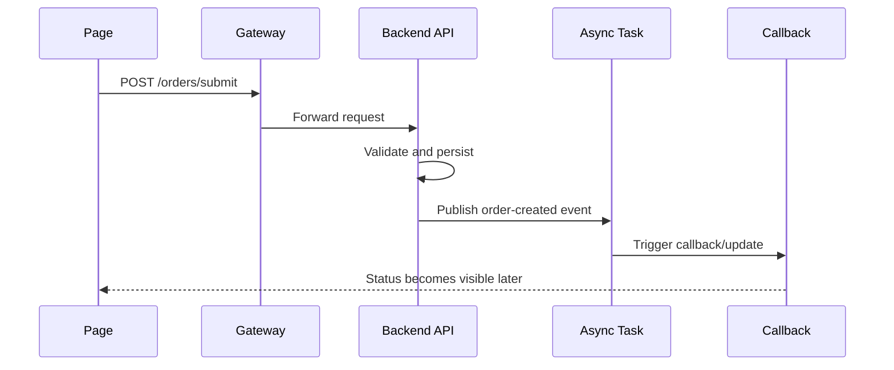

# Mixed-Stack 图产物示例模板

本文示范 `cross-tech-stack-spec-skill` 在标准执行时，一份“面向混合栈图产物”的文档大致应该长什么样。

它可以作为：

- AI 生成产物时的参考版式
- 中央知识库文档评审时的基线模板
- 团队快速理解“正文 + Mermaid 图”如何组合输出的示例

## 1. 示例范围

示例场景：

- page 发起下单请求
- app / client 层补充上下文
- gateway 转发请求
- backend 服务落库并触发异步任务
- callback 或下游消费者回写最终状态

## 2. 推荐页面结构

推荐章节顺序：

1. 范围与证据边界说明
2. 混合栈架构图
3. 跨层调用关系图
4. 关键时序图
5. 开启对应开关后补充的接口 / gateway / 上下文 / 异步图
6. unresolved 清单

## 3. 范围与证据边界示例

示例写法：

```md
## Scope

This page documents the `submitOrder` flow across page, app, gateway, backend, async task, and callback layers.

## Evidence Boundary

- page request declaration visible
- app API wrapper visible
- gateway forwarding rule visible
- backend controller and service visible
- async producer and consumer visible
- callback closure partially visible
```

## 4. 混合栈架构图示例


图下方建议配一段简短说明，例如：

```md
This diagram shows the stable cross-layer shape of the `submitOrder` flow.
The gateway and async worker are both part of the critical path.
Node meaning: `Order Page` is the caller-side page, `Gateway / BFF` is the forwarding boundary, and `Async Worker` is the runtime continuation layer.
Evidence basis: page request declaration, gateway forwarding rule, backend handler, and async producer/consumer are all visible in code.
Closure state: callback closure remains partially closed in the current scope.
```

## 5. 跨层调用关系图示例

```mermaid
flowchart TD
    PageSubmit[Page: submitOrder()]
    ApiWrapper[Client API Wrapper]
    GatewayRoute[Gateway Route]
    Controller[Backend Controller]
    Service[Order Service]
    Producer[Event Producer]
    Consumer[Async Consumer]

    PageSubmit -->|HTTP| ApiWrapper
    ApiWrapper -->|HTTP| GatewayRoute
    GatewayRoute -->|Gateway| Controller
    Controller -->|Runtime invocation| Service
    Service -->|MQ| Producer
    Producer -->|MQ| Consumer
```

图下方建议补一句摘要：

```md
The synchronous path closes at `Order Service`.
The async continuation is visible from producer to consumer, but the final business acknowledgment remains partially closed.
Edge meaning: `HTTP` is request dispatch, `Gateway` is forwarding through the gateway layer, and `MQ` is async event delivery.
Evidence basis: client wrapper, gateway route, backend handler, and producer/consumer call sites are directly visible.
```

## 6. 时序图示例



图下方建议说明：

```md
This sequence highlights the handoff from synchronous request handling to asynchronous completion.
If callback evidence is incomplete, mark the final step as partially closed.
Do not redraw the callback as fully confirmed unless the receiver-side evidence is also visible.
```

## 7. 可选开关图位示例

如果开启了可选开关，可以在对应正文下面补相应图块。

### `enable_contract_map`

补：

- 接口映射图

### `enable_gateway_map`

补：

- 网关转发图

### `enable_field_lineage`

补：

- 必要时补字段流转图

### `enable_context_propagation_map`

补：

- 上下文传播图

### `enable_error_semantics`

补：

- 必要时补失败链路时序图

### `enable_async_contract_map`

补：

- producer/topic/consumer 链路图

## 8. Unresolved 清单示例

推荐格式：

```md
## Unresolved Items

- final callback receiver not fully closed in current repository scope
- tenant propagation visible at gateway entry, but downstream rewrite point is unresolved
- one async retry rule inferred from config naming only; evidence level remains clue-level
```

## 9. 放置规则提醒

默认策略：

- 优先把图和解释文字放在同一份正文里

只有在以下情况下，才拆到 `mydocs/diagrams/`：

- 同一张图要被多个文档复用
- 图本身会独立且高频变化
- 团队需要集中导出或管理图资产
- 用户明确要求图文分离
