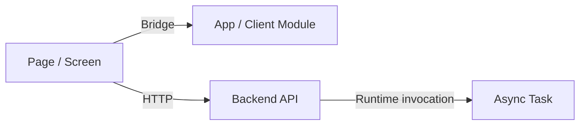

# Mixed-Stack Diagram Output Guidelines

This page defines how `cross-tech-stack-spec-skill` should output diagrams for mixed-stack repositories.

## Default Format

- prefer `.md` files with Mermaid fenced blocks
- avoid image-only output as the primary artifact
- keep nearby explanatory text so both humans and AI can read the diagram in context

## Recommended Diagram Types

- global mixed-stack architecture
- cross-layer call graph
- sequence flow across page/app/backend/task/callback/bridge layers
- code dependency graph versus runtime dependency graph
- interface mapping
- context propagation
- gateway forwarding
- async contract routes

## Placement Rule

Default strategy:

- embed the diagram directly into the corresponding document first

Only split to `mydocs/diagrams/` when at least one of these is true:

- the same diagram must be reused across multiple documents
- the diagram is expected to change independently and frequently
- the team wants centralized diagram export or asset management
- the user explicitly asks for diagram/text separation

If the diagram is split out:

- keep a short summary in the parent document
- add a direct link to the standalone diagram file
- keep enough local wording around the link so AI can still understand the diagram's role

## Edge Label Rule

Always label edge types explicitly in mixed-stack diagrams, for example:

- `HTTP`
- `Gateway`
- `Bridge`
- `MQ`
- `Callback`
- `Local dependency`
- `Runtime invocation`

## Explanation Rule

Below each diagram, add a short explanation that covers:

- what the main nodes represent
- what the main edge labels mean
- which evidence sources support the visible relationships
- which parts are fully closed, partially closed, or unresolved

Do not present guessed relationships as confirmed relationships in either the diagram or the explanatory text.

## Minimal Mermaid Template

## Read Next

- [Mixed-Stack Diagram Output Example Template](./diagram-output-example-template.md)
