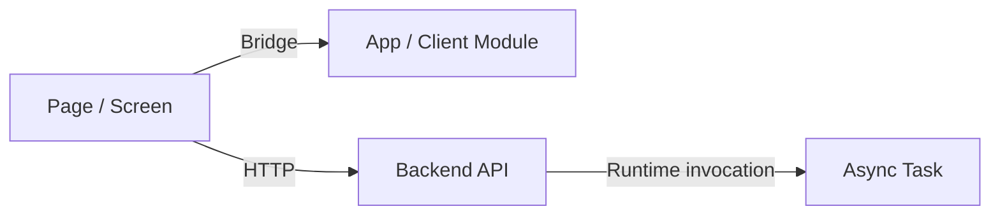

# Mixed-Stack 图产物输出规范

本文定义 `cross-tech-stack-spec-skill` 在混合栈仓库中应如何输出图产物。

## 默认格式

- 优先使用带 Mermaid 代码块的 `.md` 文件
- 不要把纯图片作为主要产物形式
- 图前后应保留必要说明文字，保证人和 AI 都能结合上下文理解

## 推荐图类型

- 全局 mixed-stack 架构图
- 跨层调用关系图
- page / app / backend / task / callback / bridge 的时序图
- 代码依赖图与运行时依赖图
- 接口映射图
- 上下文传播图
- gateway 转发图
- 异步契约链路图

## 放置规则

默认策略：

- 优先把图直接内嵌到对应正文文档

只有命中以下任一条件时，才拆分到 `mydocs/diagrams/`：

- 同一张图需要被多个文档复用
- 图预计会独立且高频更新
- 团队需要集中导出或统一管理 PNG / SVG 或图资产
- 用户明确要求图文分离

如果图被拆出：

- 正文中仍要保留一段简短摘要
- 正文中还要附上该独立图文件的直接链接
- 链接前后要保留足够语义，让 AI 仍能理解这张图表达的对象和作用

## 边标签规则

mixed-stack 图中的边，应该显式标注类型，例如：

- `HTTP`
- `Gateway`
- `Bridge`
- `MQ`
- `Callback`
- `Local dependency`
- `Runtime invocation`

## 图下说明规则

每张图下方都应补一段简短说明，至少交代：

- 主要节点分别表示什么
- 主要边标签分别表示什么
- 当前可见关系由哪些证据来源支撑
- 哪些部分已经闭环，哪些仍是 partially closed 或 unresolved

无论在图里还是图下说明里，都不要把猜测关系写成已确认关系。

## Mermaid 兼容性基线

为了减少不同 Mermaid 渲染器之间的解析差异，mixed-stack 图建议额外遵守以下基线：

- 节点标签优先写角色语义或动作语义，不要把完整方法签名直接塞进节点
- 避免在单个节点里混入 `method(arg)`、泛型、复杂 JSON 片段、未转义引号或过长标点串
- 精确的方法名、DTO 名、枚举名、Redis key、topic 名保留在图下正文中说明即可
- 如果需要表达“按某字段查询”，优先写成 `query relation by businessId` 这类短语
- 如果需要换行，尽量让每一行都是短短的语义片段，不要一行塞满代码细节
- 图节点的首要目标是稳定渲染和快速识别，代码级精确性由图下说明补足
- 图生成后，交付前必须对照 `mermaid-safety-checklist.zh-CN.md` 及其中的正反示例再做一轮显式自检

## 最小 Mermaid 模板

## 继续阅读

- [图产物示例模板](./diagram-output-example-template.zh-CN.md)
