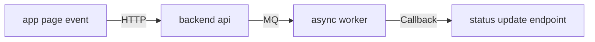

# Mermaid 自检清单

本文用于约束 mixed-stack 图产物在交付前的最后一轮自检，重点不是补业务结论，而是降低 Mermaid 渲染失败、标签歧义和跨层误读风险。

## 1. 使用时机

适用场景：

- 已经生成了 mixed-stack Markdown + Mermaid 图
- 准备把图写入 `mydocs/` 或中央知识库
- 需要在交付前确认这张图既能稳定渲染，也能被人和 AI 可靠理解

这份清单不负责：

- 决定分析 scope
- 替代业务补证
- 替代接口核验
- 只负责检查“图现在这种写法是否安全、清楚、可交付”

## 2. mixed-stack 图最容易出的错

相比纯后端图，mixed-stack 图更容易出现以下问题：

- 一个节点里同时塞 page / app / backend / task 多层含义
- 节点标签直接写方法签名、payload、bridge 参数
- 边没有写类型，导致 HTTP / Gateway / Bridge / MQ 混在一起
- 把调用声明侧看成完整闭环
- 把前端入口、后端 handler、异步 continuation 混成一团

## 3. 节点标签检查

推荐写法：

- `page submit order`
- `query relation by businessId`
- `gateway forward route`
- `sync chat record in database`
- `async consumer handle callback`

不推荐写法：

- `submitOrder(payload, token, traceId)`
- `getGroupChatRelationshipInfo(businessId)`
- `bridge.invoke("openPage", {...})`
- `modifyChatRecord({"msgKey":"123"})`

检查点：

- 节点优先表达“角色语义”或“动作语义”
- 不要把复杂代码细节直接塞进图节点
- 前端页面名、模块名、handler 名可以保留，但尽量避免完整方法签名
- 精确方法名、DTO、payload 细节放到图下说明

## 4. 高风险字符检查

以下内容一旦直接进节点，渲染风险会明显上升：

- `(` `)`
- `{` `}`
- `"` `'`
- 泛型尖括号
- 长 URL
- JSON 片段
- SQL 片段
- 过密的 `:`、`,`、`.` 串

处理原则：

- 改成短语
- 或者移到图下说明
- 图节点优先可渲染，再追求代码细节

## 5. 边标签检查

每条关键边都要尽量标注类型，尤其 mixed-stack 场景下必须区分：

- `HTTP`
- `Gateway`
- `Bridge`
- `MQ`
- `Callback`
- `Runtime invocation`
- `Local dependency`

如果边没有标签，最常见的问题是：

- 用户看不出这是前端请求、网关转发还是本地模块依赖
- AI 下次复用时容易误推断链路类型

## 6. 图下说明检查

每张图下至少补以下信息：

- 主要节点分别代表哪一层
- 主要边标签分别代表什么
- 当前证据来自哪里
- 哪些部分是 `fact-closed`
- 哪些部分只是 `contract-visible`、`fact-send-side` 或 `clue`

对于 mixed-stack 图，这一点尤其重要，因为很多链路本来就是分层可见、局部闭环，而不是全链路都闭环。

## 7. 证据等级检查

必须确认：

- 页面/API wrapper 可见，不代表 handler 一定可见
- 只看到深链发起端，不代表 App 接收页已经闭环
- 只看到 consumer，不代表 producer 已闭环
- 只看到 gateway 路径命名，不代表真实网关实现已经闭环

推荐标注：

- `fact-closed`
- `fact-send-side`
- `fact-receive-side`
- `contract-visible`
- `clue`
- `fact-code-present-but-disabled`
- `fact-code-present-no-op`

## 8. 快速自检问答

在提交 mixed-stack 图前，快速问自己：

1. 节点里有没有 `method(arg)`、bridge payload、JSON 片段？
2. 边上有没有清楚写明 `HTTP` / `Gateway` / `Bridge` / `MQ`？
3. 这张图有没有把“看见调用侧”误写成“全链路闭环”？
4. 如果不看正文，只看图，用户能否分清 page、app、backend、task？
5. 如果 Mermaid 渲染器更严格，这张图是否还能过？

## 9. 最终通过标准

可以交付的最低标准：

- 图能稳定渲染
- 节点标签短而清楚
- 边标签清晰区分链路类型
- 图下说明存在
- 证据等级没有混乱
- 没有把线索误画成事实

## 10. 最小合格示例与错误示例

推荐示例：



图下说明示例：

- `app page event` 表示客户端页面行为，具体页面名和触发方法写在正文
- `backend api -> async worker` 表示异步投递，不等同于同步闭环
- `status update endpoint` 当前只确认接收侧时，应标注为 `fact-receive-side`

错误示例：

```mermaid
flowchart LR
    A[page.onLoad()->bridge.invoke({"route":"topic/detail"})] --> B[gateway/api/topic/detail]
    B --> C[TopicController.detail(id, traceId)]
    C --> D[kafka topic + callback + db update]
```

错误原因：

- 单个节点混入页面方法、bridge payload、路由参数
- `gateway/api/topic/detail` 既像路径又像节点角色，语义不清
- `kafka topic + callback + db update` 把多种链路类型压成一个节点，AI 和人都容易误读

## 11. 一句话原则

mixed-stack 图节点负责“稳定表达跨层结构”，图下正文负责“精确表达代码与证据细节”。
